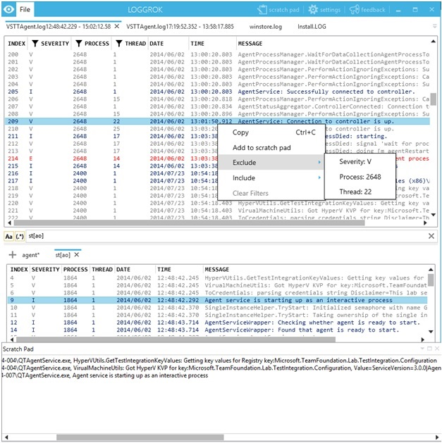

# This repository is abandoned.
## Development of the next version of Loggrok continues at https://github.com/pekabon/LogGrokCore

LogGrok is the multi-file log viewer with customizable docking windows UI.
 
# Key Features:
•	Large files support
•	Search by any field (including RegEx)
•	Multiple search results
•	Filter the log by any field for MSI, VB, NLog and Log4Net/Log4j(with XmlLayout)
•	Background and text colors customization
•	File drag & drop support (including multiple files)
•	Scratch pad for copying log entries
•	Opening files partially
•	Customizable docking windows UI
•	Supports all types of logs

# Download 

ClickOnce installer is [here](https://raw.githubusercontent.com/pekabon/LogGrok/master/publish/setup.exe)

**More info:** [docs/Documentation.md](docs/Documentation.md)

Submit your **Feedback:** [https://loggrok.uservoice.com/forums/263295-general](https://loggrok.uservoice.com/forums/263295-general)

