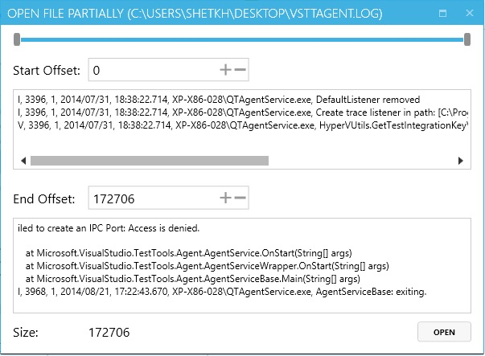
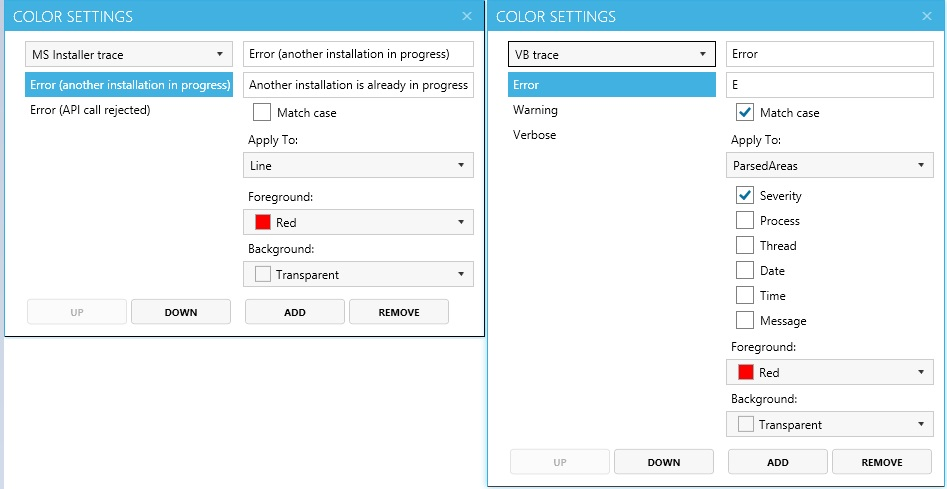

# Opening Logs
There are several ways to open log files:
- drag-and-drop log file, several log files or folder with logs to the program UI.
- open log file(s) from the main menu
- open log file(s) partially from the main menu:

# Filters
You can set up filters for most of parsed fields:

Or exclude log entries directly from the log view:

# Highlighters
Customizable and extendible highlighters can be configured for all supported types of traces. 
Highlighters configuration is available from settings menu.
Common highlighters are already pre-configured to facilitate logs browsing.

# Multiple Search Results
Program supports multiple search results and search by regular expressions.
Search options:
-	**Aa** button – match case
-	**(.** ** **)** button – enables regular expressions search
-	**+** button – opens new search

# Scratch pad
LogGrok has built-in docking scratch pad. Needed log record can be added directly from the log view:

